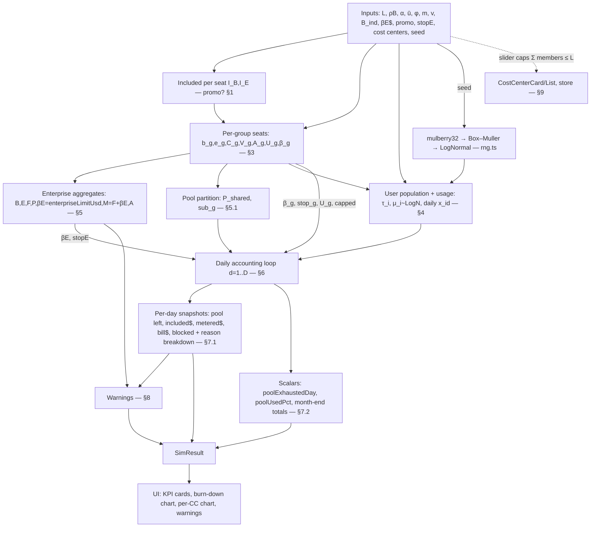

# Simulation Engine — data flow & interconnections

How the [`formulas.md`](./formulas.md) quantities connect end-to-end. The engine is the **pure function** `runSimulation(inputs) → SimResult` in [`src/model/engine.ts`](https://github.com/webmaxru/finops-copilot/blob/main/src/model/engine.ts). It is recomputed once per input change and memoized in `state/store.ts` (`useSimResult`); the charts plot the precomputed daily snapshots directly, and re-renders never trigger recomputation.

## Dependency graph

## Ordered algorithm

1. **Resolve included allowances** $I_B,I_E$ from the `promo` flag (`engine.ts:98-99`).
2. **Build groups** (`engine.ts:102-142`): one `GroupState` per cost center (applying inheritance for plan mix and per-user limit; the metered budget is an explicit absolute USD value scaled to the CC's seats, §5.3), then the **unassigned** group with $s_U=\max(0,L-\sum s_{cc})$. Each group precomputes $b_g,e_g,C_g,V_g,A_g,U_g,\beta_g$ (§3).
3. **Aggregate to the enterprise** (`engine.ts:144-159`): $B,E,F,P,\beta_E=\text{enterpriseLimitUsd},M=F+\beta_E,A$ (§5). The default and slider max of $\beta_E$ are derived at $v=0$ (§5.2).
4. **Partition the pool** (`engine.ts:161-163`): capped CCs get their own $\text{sub}_g=C_g$; the rest form $P_{\text{shared}}$ (§5.1).
5. **Generate the population** (`engine.ts:165-191`): for each group, mark power users, draw each user's monthly $\mu_i$ and 30 daily shares $x_{i,d}$ from the seeded log-normal (§4).
6. **Run the day loop** $d=1..D$ (`engine.ts:237-358`): for each unblocked user apply the **user limit → pool → metered (CC then enterprise)** cascade (§6), tag any newly blocked user with the binding stop (§6d), then push per-group and enterprise snapshots (with the blocked-reason breakdown).
7. **Assemble `SimResult`** (`engine.ts:360-448`) and compute **warnings** (§8).

## Why the ordering matters (interconnections)

- **Included before metered.** Every credit is first taken from the relevant pool ($\text{sub}_g$ for capped CCs, else $P_{\text{shared}}$); only the leftover $\ell$ becomes metered. This is what makes the burn-down chart show the pool draining *before* metered cost appears. Every chart — the enterprise burndown and each cost center / unassigned group — plots the **same depleting "Included pool left"** area for a consistent story: the enterprise shows total remaining credits, and each group shows its own funded included allowance draining ($C_g\cdot c-\mathrm{In}_g$; = $\text{sub}_g\cdot c$ for a capped CC, and may dip below 0 for a shared-pool group that over-draws — see `formulas.md` §7.3). (At a cost-center AI-credit-pool cap the leftover spills to metered because overages are assumed enabled, §5.7; whether the cap overages or stops is the global enterprise policy, not a per-CC control — `billing-model.md` §6.) [B1][B13]
- **User limit gates everything.** $U_g$ (a user-level budget) caps a person's **total** pool+metered use and always hard-stops, so it is checked *first* and can prevent both pool draw and metered spend. [B4]
- **Budgets cap only the metered leg.** $\beta_g$ (CC) and $\beta_E$ (enterprise) are applied inside `ApplyMetered`, i.e. after the pool is exhausted — never limiting pool use. Their `stop` flags decide whether the cap actually blocks or merely would-alert (charges still accrue). [B4][B5][B6]
- **Enterprise budget can exclude cost centers.** When `enterpriseBudgetExcludesCostCenters` is on, `ApplyMetered` applies $\beta_E$ (and accrues $\mathrm{Me}_E$) only for **non-cost-center** groups; each cost center is then bounded solely by its own $\beta_g$ and spends on top of $\beta_E$. This mirrors GitHub's single **"Exclude cost center usage from this budget"** checkbox on the enterprise budget (one collective toggle over all cost centers, not a per-CC selector). [B18]
- **Additivity.** Because budgets cap only metered charges, the worst-case bill is $M=F+\beta_E$ — plus $\sum_{cc}\beta_{cc}$ when the enterprise budget excludes cost centers — not $\beta_E$ alone; the max-bill rule. The engine assumes the "AI credit paid usage" policy is enabled. [B5][B18]
- **"Blocked" means any hard stop — and we record *why*.** A user is counted blocked for the month if a hard stop kept them from consuming what they wanted that day ($\text{spent}<x_{i,d}$) — whether from their **user limit** ($U_g$ / power-user override $B_{\text{pow}}$) or a cost-center/enterprise **metered-budget stop** whose `stop` flag is on. (An AI-credit-pool cap does not block in the model — overages are assumed enabled, so its excess spills to metered; §5.7.) Each blocked user is attributed to the **single binding stop** (`userLimit` / `costCenterBudget` / `enterpriseBudget`, §6d), so `blockedBreakdown` always sums to `blockedUsers`; the UI shows this split in chart hover-tooltips and the global KPI (no extra chart lines). So enabling a budget stop that binds correctly shows blocked users — attributed to that budget — even when nobody exceeds their own per-user limit (§6d). [B4][B6][B16]
- **Determinism.** All randomness flows from `seed` through one `mulberry32` stream consumed in a fixed order (groups, then users, then that user's 30 daily weights), so a given input always yields identical output; "Reshuffle" changes only `seed`.

## Complexity & performance

One recompute samples $\approx A\,(1+D)$ log-normal variates and runs $A\cdot D$ inner iterations (≤ 1000 × 30 = 30k). Each day the blocked-user counts + reason breakdown are tallied in one pass over users into a per-group map, so the recount is $O((A+G)\cdot D)$. All well under a millisecond-scale budget; the month is computed once and cached, so every component renders from the shared result without recomputing.

## Extension points

- **Token-level costs** → replace the direct $\bar u$ / $\mu_i$ with a token→credit estimator (`billing-model.md` §7.1); the daily-share and accounting machinery is unaffected.
- **Auto-select / data-residency multipliers** → scale $\mu_i$ (or per-interaction credits) by $0.90$ / $1.10$ before step 6 (`billing-model.md` §7.2–7.3).
- **Organization-scope budgets** → add an $\text{org}$ tier in `ApplyMetered` between CC and enterprise (GitHub order is CC → org → enterprise [B4]); currently orgs are not modeled distinctly from cost centers.
- **Multi-month / rollover** → wrap the day loop in a month loop; note GitHub pools reset monthly with no carryover [B1].
