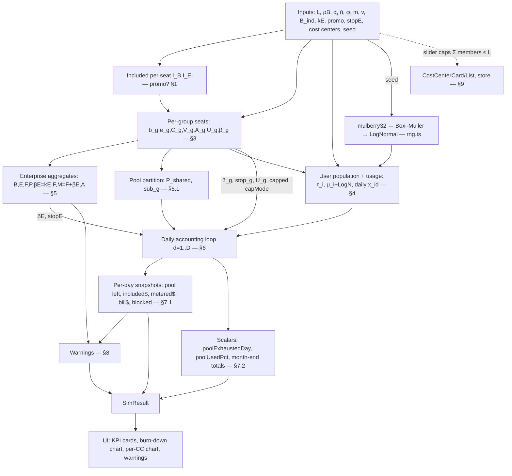

# Simulation Engine — data flow & interconnections

How the [`formulas.md`](./formulas.md) quantities connect end-to-end. The engine is the **pure function** `runSimulation(inputs) → SimResult` in [`src/model/engine.ts`](https://github.com/webmaxru/finops-copilot/blob/a033e79/src/model/engine.ts). It is recomputed once per input change and memoized in `state/store.ts` (`useSimResult`); the timeline day only selects which precomputed snapshot to display and never triggers recomputation.

## Dependency graph

## Ordered algorithm

1. **Resolve included allowances** $I_B,I_E$ from the `promo` flag (`engine.ts:88-89`).
2. **Build groups** (`engine.ts:92-132`): one `GroupState` per cost center (applying inheritance for plan mix, per-user limit, budget multiple), then the **unassigned** group with $s_U=\max(0,L-\sum s_{cc})$. Each group precomputes $b_g,e_g,C_g,V_g,A_g,U_g,\beta_g$ (§3).
3. **Aggregate to the enterprise** (`engine.ts:135-141`): $B,E,F,P,\beta_E=k_E F,M=F+\beta_E,A$ (§5).
4. **Partition the pool** (`engine.ts:143-145`): capped CCs get their own $\text{sub}_g=C_g$; the rest form $P_{\text{shared}}$ (§5.1).
5. **Generate the population** (`engine.ts:148-167`): for each group, mark power users, draw each user's monthly $\mu_i$ and 30 daily shares $x_{i,d}$ from the seeded log-normal (§4).
6. **Run the day loop** $d=1..D$ (`engine.ts:190-255`): for each unblocked user apply the **user limit → pool → metered (CC then enterprise)** cascade (§6), then push per-group and enterprise snapshots.
7. **Assemble `SimResult`** (`engine.ts:257-289`) and compute **warnings** (§8).

## Why the ordering matters (interconnections)

- **Included before metered.** Every credit is first taken from the relevant pool ($\text{sub}_g$ for capped CCs, else $P_{\text{shared}}$); only the leftover $\ell$ becomes metered. This is what makes the burn-down chart show the pool draining *before* metered cost appears. [B1]
- **User limit gates everything.** $U_g$ (a user-level budget) caps a person's **total** pool+metered use and always hard-stops, so it is checked *first* and can prevent both pool draw and metered spend. [B4]
- **Budgets cap only the metered leg.** $\beta_g$ (CC) and $\beta_E$ (enterprise) are applied inside `ApplyMetered`, i.e. after the pool is exhausted — never limiting pool use. Their `stop` flags decide whether the cap actually blocks or merely would-alert (charges still accrue). [B4][B5][B6]
- **Additivity.** Because budgets cap only metered charges, the worst-case bill is $M=F+\beta_E$, not $\beta_E$ — the max-bill rule. [B5]
- **Determinism.** All randomness flows from `seed` through one `mulberry32` stream consumed in a fixed order (groups, then users, then that user's 30 daily weights), so a given input always yields identical output; "Reshuffle" changes only `seed`.

## Complexity & performance

One recompute samples $\approx A\,(1+D)$ log-normal variates and runs $A\cdot D$ inner iterations (≤ 1000 × 30 = 30k). The per-group blocked-user recount is $O(A\cdot G\cdot D)$. All well under a millisecond-scale budget; the month is computed once and cached, so scrubbing/animating the timeline is free.

## Extension points

- **Token-level costs** → replace the direct $\bar u$ / $\mu_i$ with a token→credit estimator (`billing-model.md` §7.1); the daily-share and accounting machinery is unaffected.
- **Auto-select / data-residency multipliers** → scale $\mu_i$ (or per-interaction credits) by $0.90$ / $1.10$ before step 6 (`billing-model.md` §7.2–7.3).
- **Organization-scope budgets** → add an $\text{org}$ tier in `ApplyMetered` between CC and enterprise (GitHub order is CC → org → enterprise [B4]); currently orgs are not modeled distinctly from cost centers.
- **Multi-month / rollover** → wrap the day loop in a month loop; note GitHub pools reset monthly with no carryover [B1].
